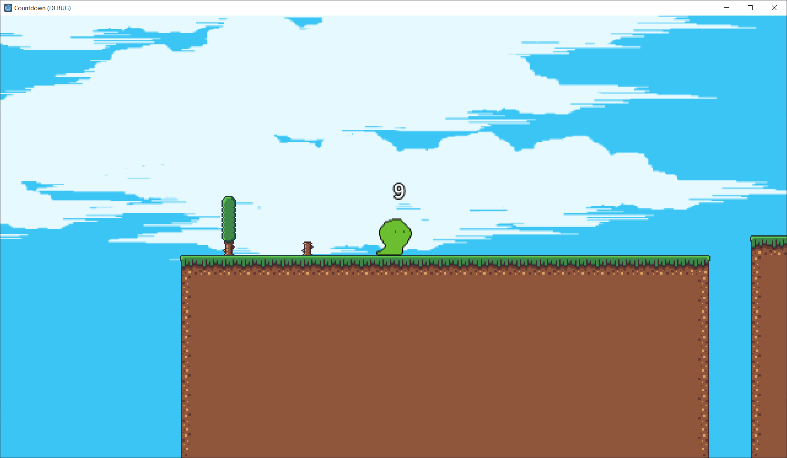

# Countdown
A 2D platformer game made in Godot. \
The player must drink a potion before the timer ends to survive to the next level.

## **Instruction below**
Create a *Secret.gd* file in the root directory and give it a string value to the *password* variable. \
Example: `var password := "your password"` \
The password is used for encrypting and decrypting the save file.

